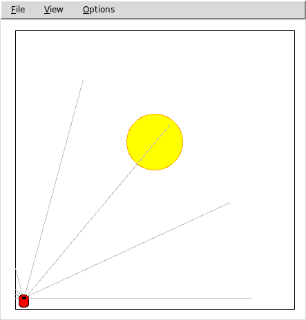

Evolutionary Programming meets Fuzzy Logic
==========================================

<p align="center">
  
</p>

Evolution of a fuzzy controller for mobile robot guidance
----------------------------------------------------------

   **Simulator**: Pyro  
   **Robot**: PyrobotRobot60000.py  (Pioneer)  
   **World**: Light.py


Run command: 
```
pyrobot/bin/pyrobot -r PyrobotRobot60000.py -s PyrobotSimulator -c Light.py -b GreatExpectations.py -g TTY -e "run"
```
